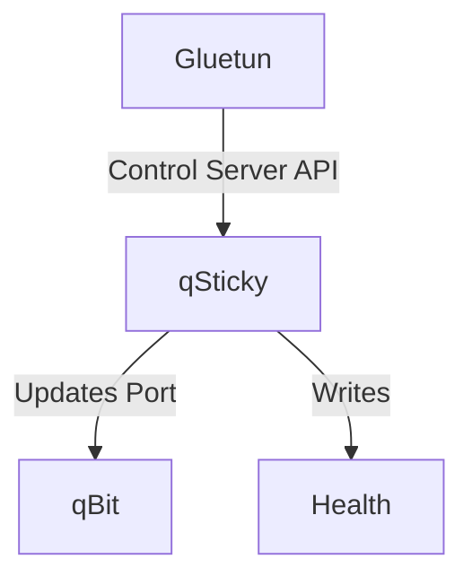

# qSticky
qSticky is an automated port forwarding manager for Gluetun and qBittorrent. It automatically updates qBittorrent's listening port whenever Gluetun receives a new forwarded port.


## Features
- 🔄 Automatic port synchronization
- 👀 Real-time file watching with fallback polling
- 🔒 Secure HTTPS support
- 🐳 Docker deployment
- 📝 Logging

## How it Works
qSticky monitors Gluetun's port forwarding through its [control server API](https://github.com/qdm12/gluetun-wiki/blob/main/setup/advanced/control-server.md#openvpn-and-wireguard) and updates qBittorrent's connection settings as needed.

1. **Port Monitoring**
   - qSticky queries Gluetun's control server API endpoint at `/v1/openvpn/portforwarded`
   - Supports both Basic Auth and API Key authentication methods
   - Polls the API at configurable intervals (default: 30 seconds)

2. **Port Management**
   - When a new port is detected:
     - Retrieves the port number from Gluetun's API
     - Connects to qBittorrent's WebUI API
     - Updates qBittorrent's listening port
     - Verifies the change was successful

3. **Health Monitoring**
   - Maintains a health status file
   - Checks qBittorrent connectivity regularly
   - Tracks port changes and any errors
   - Provides Docker health checks

4. **Recovery & Resilience**
   - Automatically retries on connection failures
   - Maintains session with qBittorrent
   - Handles network interruptions gracefully
   - Logs important events and errors

### Flow


# Quick Start

> [!IMPORTANT]  
> qSticky only supports [whatever gluetun natively supports for automatic port forwarding.](https://github.com/qdm12/gluetun-wiki/blob/main/setup/advanced/vpn-port-forwarding.md#native-integrations) At time of writing, this is PIA and ProtonVPN.

## 🔑 Authentication Setup
qSticky requires access to Gluetun's control server API to monitor port forwarding. For security, you should enable authentication on Gluetun's control server. Gluetun has deprecation notices for unauthenticated endpoints, so this **will** be required if it's not already.

### Create Authentication Config
Create a `config.toml` file somewhere to be mapped into gluetun:
```toml
[[roles]]
name = "qSticky"
routes = ["GET /v1/openvpn/portforwarded"]
auth = "apikey"
apikey = "your_api_key_here"
```

Or if you prefer basic auth:
```toml
[[roles]]
name = "qSticky"
routes = ["GET /v1/openvpn/portforwarded"]
auth = "basic"
username = "myusername"
password = "mypassword"
```
### Volume mount
As in the below examples, mount the config in your docker-compose.yml:
```yaml
services:
  gluetun:
    # ... other gluetun config ...
    volumes:
      - ./gluetun/config.toml:/gluetun/auth/config.toml  # Mount auth config
```

### qSticky Configuration
Configure qSticky to use the same authentication method:
```yaml
services:
  qSticky:
    # ... other qSticky config ...
    environment:
      # For API Key auth:
      GLUETUN_AUTH_TYPE: apikey
      GLUETUN_APIKEY: your_api_key_here

      # Or for Basic auth:
      # GLUETUN_AUTH_TYPE: basic
      # GLUETUN_USERNAME: myusername
      # GLUETUN_PASSWORD: mypassword
```

For complete details on Gluetun's control server authentication, check out the [official Gluetun documentation.](https://github.com/qdm12/gluetun-wiki/blob/main/setup/advanced/control-server.md#openvpn-and-wireguard)

## Gluetun Setup
Gluetun setup is simple and if you're already using it you may just need to add some simple env vars:

To set up port forwarding:
1. Enable port forwarding in Gluetun by setting `VPN_PORT_FORWARDING=on`
2. Configure Gluetun's control server (as above).
3. Ensure qSticky has network access to Gluetun's control server.
4. Configure authentication (API key or Basic Auth).

A working Gluetun configuration **might** look like:
```yaml
services:
  gluetun:
    image: qmcgaw/gluetun:latest
    container_name: gluetun
    environment:
      VPN_SERVICE_PROVIDER: protonvpn
      VPN_TYPE: wireguard
      VPN_PORT_FORWARDING: on
      WIREGUARD_PRIVATE_KEY: 'wOEI9rqqbDwnN8/Bpp22sVz48T71vJ4fYmFWujulwUU='
      SERVER_COUNTRIES: Netherlands
```
> [!NOTE]  
> Since we are using gluetun's own container network, port `8000` does not need to be explicitly mapped in docker. If you wish to use the API outside og gluetun's container network, you should map the port.

## qSticky Setup
> [!TIP]
> A full list of environment variables are listed and explained below.

To deploy qSticky, add the service to your compose file as so, changing settings as required:
```yaml
services:
  qSticky:
    image: ghcr.io/monstermuffin/qSticky:latest
    container_name: qSticky
    restart: unless-stopped
    network_mode: "container:gluetun"
    environment:
      # qbittorrent settings
      QBITTORRENT_HOST: localhost
      QBITTORRENT_HTTPS: false
      QBITTORRENT_PORT: 8080
      QBITTORRENT_USER: admin
      QBITTORRENT_PASS: adminadmin
      # gluetun settings
      GLUETUN_AUTH_TYPE: apikey
      GLUETUN_APIKEY: put_api_key_here
```

## qbittorrent Setup

Qbittorrent can be deployed like the following example. There will be a lot of other containers available for qbittorrent and what you use is up to you, below is an example from [lsio.io](https://www.linuxserver.io/) as they are popular.
```yaml
services:
  qbittorrent:
    container_name: qbittorrent
    image: linuxserver/qbittorrent:latest
    network_mode: container:gluetun
    environment:
      PUID: 1000
      PGID: 1000
      TZ: UTC
      WEBUI_PORT: 8080
    volumes:
      - ./qbittorrent/config:/config
      - ./downloads:/downloads
    restart: unless-stopped
    depends_on:
      - gluetun
```

## Full Stack Setup
Here is an example stack for deploying Gluetun, qBitorrent and qSticky:

> [!NOTE]  
> Your VPN configuration will look somewhat different to very different based on protocol and/or provider. Please check the gluetun docs. You should get gluetun working before setting up qSticky if unsure.

```yaml
services:
  gluetun:
    container_name: gluetun
    image: qmcgaw/gluetun:latest
    cap_add:
      - NET_ADMIN
    environment:
      VPN_SERVICE_PROVIDER: protonvpn
      VPN_TYPE: wireguard
      VPN_PORT_FORWARDING: on
      WIREGUARD_PRIVATE_KEY: your_private_key
      WIREGUARD_ADDRESSES: your_wireguard_ip
      SERVER_COUNTRIES: Netherlands
      # Control server config for qSticky
      GLUETUN_HTTP_CONTROL_SERVER_ENABLE: on
      GLUETUN_HTTP_CONTROL_SERVER_PORT: 8000
      GLUETUN_HTTP_CONTROL_SERVER_APIKEY: your_api_key_here
    volumes:
      - ./gluetun/config.toml:/gluetun/auth/config.toml # https://github.com/qdm12/gluetun-wiki/blob/main/setup/advanced/control-server.md#authentication
    ports:
      - 8080:8080  # qBittorrent WebUI
    restart: unless-stopped

  qbittorrent:
    container_name: qbittorrent
    image: linuxserver/qbittorrent:latest
    network_mode: container:gluetun
    environment:
      PUID: 1000
      PGID: 1000
      TZ: UTC
      WEBUI_PORT: 8080
    volumes:
      - ./qbittorrent/config:/config
      - ./downloads:/downloads
    restart: unless-stopped
    depends_on:
      - gluetun

  qSticky:
    container_name: qSticky
    image: ghcr.io/monstermuffin/qSticky:latest
    network_mode: container:gluetun
    environment:
      # qBittorrent settings
      QBITTORRENT_HOST: localhost
      QBITTORRENT_HTTPS: false
      QBITTORRENT_PORT: 8080
      QBITTORRENT_USER: admin
      QBITTORRENT_PASS: adminadmin
      # Gluetun settings
      GLUETUN_AUTH_TYPE: apikey # https://github.com/qdm12/gluetun-wiki/blob/main/setup/advanced/control-server.md#authentication
      GLUETUN_APIKEY: your_api_key_here
      # qSticky settings
      LOG_LEVEL: INFO
    healthcheck:
      test: ["CMD", "cat", "/tmp/health/status.json"]
      interval: 1m
      timeout: 10s
      retries: 3
    restart: unless-stopped
    depends_on:
      - gluetun
      - qbittorrent
```

> [!NOTE]  
> If using basic auth, your environment vars for qSticky would look like the following:

```yaml
      GLUETUN_AUTH_TYPE: basic
      GLUETUN_USERNAME: admin
      GLUETUN_PASSWORD: secure_password
```

# Configuration
All configuration is done through environment variables:

| Environment Variable | Description | Default |
|---------------------|-------------|---------|
| QBITTORRENT_HOST | qBittorrent server hostname | localhost |
| QBITTORRENT_PORT | qBittorrent server port | 8080 |
| QBITTORRENT_USER | qBittorrent username | admin |
| QBITTORRENT_PASS | qBittorrent password | adminadmin |
| QBITTORRENT_HTTPS | Use HTTPS for qBittorrent connection | false |
| CHECK_INTERVAL | Fallback check interval in seconds | 30 |
| LOG_LEVEL | Logging level (DEBUG, INFO, WARNING, ERROR) | INFO |
| HEALTH_FILE | Path to health status file | /tmp/health/status.json |
| GLUETUN_HOST | Gluetun control server hostname | localhost |
| GLUETUN_PORT | Gluetun control server port | 8000 |
| GLUETUN_AUTH_TYPE | Gluetun authentication type (basic/apikey) | apikey |
| GLUETUN_USERNAME | Gluetun basic auth username | "" |
| GLUETUN_PASSWORD | Gluetun basic auth password | "" |
| GLUETUN_APIKEY | Gluetun API key | "" |

## qBittorrent Credentials: First-Time Setup
Setting up qSticky with qBittorrent can present a small chicken-and-egg scenario with credentials. Here are your options:

* Option 1: Use Defaults
  * Deploy using qBittorrent's default credentials (admin/adminadmin). 
  * Change them through qBittorrent's UI afterward.

* Option 2: Staged Setup
  * Deploy qBittorrent and set your credentials
  * Update qSticky's environment with matching credentials
  * Deploy qSticky

> [!NOTE]  
> Either approach works! Just ensure qSticky's credentials match qBittorrent's final configuration.

# Checks
To check qSticky is working:

- Check qSticky logs with `docker logs qSticky`
- Verify qSticky can connect to Gluetun's control server (check logs for API connection messages)
- Confirm the port is being updated in qBittorrent's settings
- If using authentication, ensure the credentials are correctly configured
- Test the Gluetun API endpoint directly using curl (will only work if you're exposing 8000):
  
  ```bash
  # For API key auth:
  curl -H "X-API-Key: your_api_key" http://localhost:8000/v1/openvpn/portforwarded
  
  # For Basic auth:
  curl -u username:password http://localhost:8000/v1/openvpn/portforwarded
  ```

When successful, the logs will look something like the following:

```bash
2025-01-24 20:08:13,178 - qSticky - INFO - Starting qSticky port manager...
2025-01-24 20:08:13,185 - qSticky - INFO - Successfully logged in to qBittorrent
2025-01-24 20:08:13,186 - qSticky - INFO - Port change needed: 58988 -> 51218
2025-01-24 20:08:13,189 - qSticky - INFO - Successfully updated port to 51218
```

# User Permissions
qSticky can run as any user, which is particularly useful when running with qBittorrent's user permissions. To run as a specific user, use the `user:` directive in your docker-compose file:

```yaml
services:
  qSticky:
    image: ghcr.io/monstermuffin/qSticky:latest
    user: "your-qbittorrent-user"  # Optional: Run as specific user
```

# Health Checks
qSticky includes Docker health checks. The health status is written to a file at `/app/health/status.json`. This file is managed internally by the container - you don't need to mount or manage it. Health status includes:
  - Overall health status
  - Uptime
  - Last check timestamp
  - Last port change time
  - Current port
  - Last error (if any)

The Docker container will be marked as unhealthy if:
  - The application fails to write health status
  - qBittorrent becomes unreachable
  - Port updates fail repeatedly
  - Other critical errors occur

# Development

## Prerequisites
- Python 3.11+
- pip

## Setup

1. Clone the repository:
```bash
git clone https://github.com/monstermuffin/qSticky.git
cd qSticky
```

2. Install dependencies:
```bash
pip install -r requirements.txt
```

3. Run the application:
```bash
python qSticky.py
```