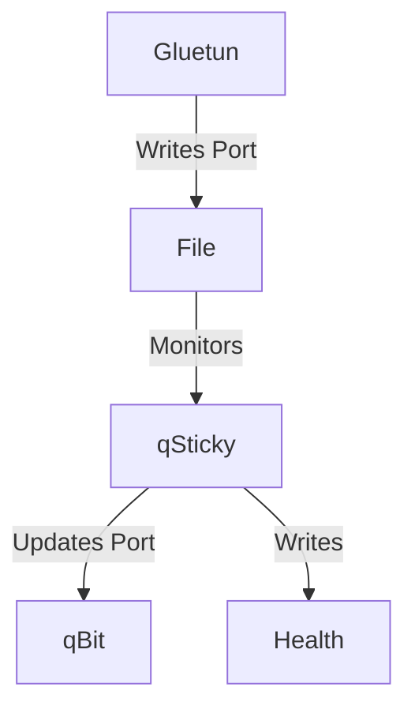

# qSticky
qSticky is an automated port forwarding manager for Gluetun and qBittorrent. It automatically updates qBittorrent's listening port whenever Gluetun receives a new forwarded port.


## Features
- 🔄 Automatic port synchronization
- 👀 Real-time file watching with fallback polling
- 🔒 Secure HTTPS support
- 🐳 Docker support
- 📝 Logging

## How it Works

qSticky acts as a bridge between Gluetun's VPN port forwarding and qBittorrent's connection settings.

1. **Port Monitoring**
   - Gluetun writes the forwarded port number to `/tmp/gluetun/forwarded_port`
   - qSticky actively monitors this file for changes using file system events
   - If event watching fails, falls back to polling every 30 seconds (configurable)

2. **Port Management**
   - When a new port is detected:
     1. Reads the new port number from the file
     2. Connects to qBittorrent's WebUI API
     3. Updates qBittorrent's listening port
     4. Verifies the change was successful

3. **Health Monitoring**
   - Maintains a health status file
   - Checks qBittorrent connectivity regularly
   - Tracks port changes and any errors
   - Provides Docker health checks

4. **Recovery & Resilience**
   - Automatically retries on connection failures
   - Maintains session with qBittorrent
   - Handles network interruptions gracefully
   - Logs important events and errors

### Flow


## Quick Start

### Port Forwarding Setup

qSticky needs access to Gluetun's forwarded port file to function. When Gluetun successfully sets up port forwarding, it writes the port number to `/tmp/gluetun/forwarded_port`. This file is monitored by qSticky to detect port changes.

To give qSticky access to this file, you need to:
1. Enable port forwarding in Gluetun by setting `VPN_PORT_FORWARDING=on`
2. Mount the Gluetun volume containing this file into the qSticky container
3. Ensure both containers share network access (using `network_mode: "service:gluetun"`)

A working Gluetun configuration might look like:
```yaml
services:
  gluetun:
    image: qmcgaw/gluetun:latest
    volumes:
      - /your/gluetun/folder:/tmp/gluetun  # This folder must be mounted in qSticky
    environment:
      - VPN_SERVICE_PROVIDER=protonvpn
      - VPN_TYPE=wireguard
      - VPN_PORT_FORWARDING=on
```

### Using Docker Compose

```yaml
services:
  qsticky:
    image: ghcr.io/monstermuffin/qsticky:latest
    restart: unless-stopped
    volumes:
      - /your/gluetun/folder:/tmp/gluetun
    network_mode: "service:gluetun"
    environment:
      - QSTICKY_QBITTORRENT_HOST=localhost
      - QSTICKY_QBITTORRENT_PORT=8080
      - QSTICKY_QBITTORRENT_USER=admin
      - QSTICKY_QBITTORRENT_PASS=adminadmin
      - QSTICKY_USE_HTTPS=false
      - QSTICKY_PORT_FILE_PATH=/tmp/gluetun/forwarded_port
      - QSTICKY_CHECK_INTERVAL=30
      - QSTICKY_LOG_LEVEL=INFO
```

### Configuration

All configuration is done through environment variables:

| Environment Variable | Description | Default |
|---------------------|-------------|---------|
| QSTICKY_QBITTORRENT_HOST | qBittorrent server hostname | localhost |
| QSTICKY_QBITTORRENT_PORT | qBittorrent server port | 8080 |
| QSTICKY_QBITTORRENT_USER | qBittorrent username | admin |
| QSTICKY_QBITTORRENT_PASS | qBittorrent password | adminadmin |
| QSTICKY_USE_HTTPS | Use HTTPS for qBittorrent connection | false |
| QSTICKY_PORT_FILE_PATH | Path to Gluetun forwarded port file | /tmp/gluetun/forwarded_port |
| QSTICKY_CHECK_INTERVAL | Fallback check interval in seconds | 30 |
| QSTICKY_LOG_LEVEL | Logging level (DEBUG, INFO, WARNING, ERROR) | INFO |
| HEALTH_FILE | Path to health status file | /tmp/health/status.json |

### Network Configuration

When using `network_mode: "service:gluetun"`, all containers share Gluetun's network stack. This is most likely how you have your stack configured to tunnel qBitorrent via Gluetun, and so qSticky can be deployed as so:

```yaml
services:
  gluetun:
    # ... gluetun config ...

  qbittorrent:
    network_mode: "service:gluetun"
    environment:
      - WEBUI_PORT=8080
  
  qsticky:
    network_mode: "service:gluetun"
    environment:
      - QSTICKY_QBITTORRENT_HOST=localhost  # Using localhost works here
      - QSTICKY_QBITTORRENT_PORT=8080
```

### User Permissions
qSticky can run as any user, which is particularly useful when running with qBittorrent's user permissions. To run as a specific user, use the `user:` directive in your docker-compose file:

```yaml
services:
  qsticky:
    image: ghcr.io/monstermuffin/qsticky:latest
    user: "your-qbittorrent-user"  # Optional: Run as specific user
```

### Health Checks
qSticky includes Docker health checks. The health status is written to a file at `/app/health/status.json`. This file is managed internally by the container - you don't need to mount or manage it. Health status includes:
- Overall health status
- Uptime
- Last check timestamp
- Last port change time
- Current port
- Last error (if any)

The Docker container will be marked as unhealthy if:
- The application fails to write health status
- qBittorrent becomes unreachable
- Port updates fail repeatedly
- Other critical errors occur

## Development

### Prerequisites
- Python 3.11+
- pip

### Setup

1. Clone the repository:
```bash
git clone https://github.com/monstermuffin/qsticky.git
cd qsticky
```

2. Install dependencies:
```bash
pip install -r requirements.txt
```

3. Run the application:
```bash
python qsticky.py
```